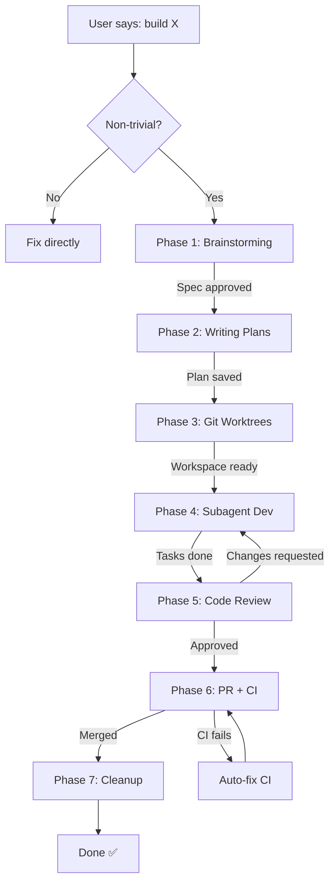

# HA-POWERS — Full-Stack Development Pipeline

> **HA-POWERS** is inspired by [obra's Superpowers](https://github.com/obra/superpowers).  
> 
>
> 🇹🇼 [繁體中文說明](zh-TW.md)

> **HA-POWERS = Hermes Agent Superpowers.**  
> A complete development pipeline from raw idea to merged PR, designed for Hermes Agent but applicable to any AI-assisted workflow.

## 🚀 Quick Start


## 📦 Installation

> ⚠️ **Not built into Hermes Agent.** This is a community-contributed skill authored by the Hermes user. It is not part of the Hermes Agent core distribution.

HA-POWERS is distributed as a **Hermes Agent skill**. No separate install needed — just place the skill in your `skills/` directory and load it.

> 🤖 **For Agents:** [Download SKILL.md](SKILL.md) + [references/](references/) — copy the **entire directory** (`SKILL.md` + `references/`) into your `skills/software-development/ha-powers/` directory to deploy the complete skill definition. The `references/` folder contains supporting docs the skill depends on.

### Prerequisites

- Hermes Agent installed and running
- Connected to a provider (Anthropic, OpenRouter, etc.)

### How to Use

There are **two ways** to run HA-POWERS:

#### Option 1: Load the Skill (Recommended)

In any Hermes session, type:

```
@skill:ha-powers
```

This loads the `ha-powers` skill and activates the full pipeline. You'll see the Progress Tracker and be guided through each phase.

#### Option 2: Let Hermes Auto-Detect

When you say "build X" or "implement a feature", Hermes with the ha-power skill loaded will **automatically** decide whether to run the pipeline or skip to a quick fix. No manual loading needed — just describe what you want.

### What Happens Next

Once loaded, HA-POWERS will:

1. Show you the **Progress Tracker** (7 phases)
2. Guide you through **Brainstorming** → **Planning** → **Development** → **Review** → **PR** → **Cleanup**
3. Update checkboxes as each phase completes
4. Create artifacts in `<project>/docs/specs/`, `<project>/docs/plans/`, and your git worktrees (inside the project directory)

### Optional: Kanban Board

For persistent multi-feature tracking, also load the kanban skill:

```
@skill:kanban
```

Then use kanban commands like:
```
kanban add "My Feature" --col backlog
kanban move K1 --col todo
kanban list
```

See the [Kanban skill docs](https://github.com/bj9421/HA-POWERS-Docs) for more.

When a user says "build X", HA-POWERS decides whether to run the full pipeline or skip to a quick fix:

```
User says "build X"
├─ Single-line fix / config change / typo?
│   └─ YES → Fix directly. Skip pipeline.
├─ Clear bug with known root cause?
│   └─ YES → Use systematic-debugging. Skip brainstorming + plans.
└─ Non-trivial new feature?
    └─ YES → Run full 7-phase pipeline
```

## 📋 Pipeline Overview



## 🧠 Design Philosophy — Why This Exists

> **The core question:** Why a 7-phase pipeline with gates, when you could just "start coding"?

### The Problem We're Solving

Without a structured pipeline, AI-assisted development has three chronic failures:

| Failure Mode | What Happens | How HA-POWERS Fixes It |
|-------------|-------------|----------------------|
| **Building the wrong thing** | Jump straight to code → realize later the spec was misunderstood → rewrite everything | Phase 1 (Brainstorming) forces a written spec and user approval BEFORE any code exists |
| **Unpredictable effort** | "It's just a small feature" → 3 days later → nothing done | Phase 2 (Writing Plans) decomposes everything into 2–5 minute tasks with exact file paths and commands |
| **No accountability** | Changes happen in the void → no review → bugs ship | Phase 5 (Code Review) + Phase 6 (PR + CI) create a mandatory quality gate before merging |

### Why 7 Phases?

Each phase solves a specific failure mode. They are **sequential and gated** — you cannot proceed until the current phase produces its artifact:

| Phase | Solves | Gate Output |
|-------|--------|-------------|
| 1. Brainstorming | "We built the wrong thing" | Approved design spec |
| 2. Writing Plans | "I don't know where to start" | Task list with exact file paths |
| 3. Git Worktrees | "My main branch is messy" | Isolated workspace |
| 4. Subagent Dev | "Coding without TDD is gambling" | Feature code + passing tests |
| 5. Code Review | "I missed bugs in my own code" | Human-quality audit |
| 6. PR + CI | "Changes went straight to main" | Merged PR with green CI |
| 7. Cleanup | "Git history is full of abandoned branches" | Clean main checkout |

**The gates are the key.** Each phase must produce a tangible artifact before the next begins. This prevents the common anti-pattern of "just start coding" — the kind of thinking that creates the most expensive rework.

### What HA-POWERS Adds on Top of Superpowers

[obra's Superpowers](https://github.com/obra/superpowers) pioneered the progressive-disclosure skill pattern. HA-POWERS builds on it by adding:

- **Orchestration layer** — Superpowers provides individual skills (brainstorming, writing-plans, etc.). HA-POWERS provides the **pipeline** that sequences them with gates.
- **Progress Tracker** — A visible checklist that shows exactly where you are in the process. Addresses the "am I done?" anxiety.
- **Phase Gates** — Explicit conditions that must be met before moving forward. Prevents skipping critical steps.
- **Single-profile architecture** — One Hermes profile (default) handles all 7 phases. Only Phase 4 may spawn 0–2 transient subagents. No need for 6 separate profiles.
- **Kanban integration** — Optional visual board for multi-feature visibility. The pipeline works identically with or without it.
- **Decision tree** — Automatic detection of when to run the full pipeline vs. skip to a quick fix.

### The Guiding Principle

> **Every feature, every time, from idea to merged PR, with no steps skipped.**

This isn't bureaucracy — it's **insurance against your future self forgetting why you made a decision today**. The spec, the plan, the PR description — they're all artifacts you (or your reviewer) will thank you for later.

---

## 🚧 Progress Tracker

Show this at the START of every feature. Update checkboxes as each phase completes.

### Phase 1: Brainstorming
- [ ] Explore context & codebase
- [ ] Ask clarifying questions
- [ ] Propose 2-3 approaches
- [ ] Present design & architecture
- [ ] Write spec to `<project>/docs/specs/`
- [ ] Self-review spec (no placeholders)
- [ ] User approves spec ✅

### Phase 2: Writing Plans
- [ ] Read approved spec
- [ ] Explore codebase patterns
- [ ] Write tasks (2-5 min each)
- [ ] Include exact file paths
- [ ] Include TDD cycle for each task
- [ ] Review plan completeness
- [ ] Save to `<project>/docs/plans/` ✅

### Phase 3: Git Worktrees
- [ ] Detect existing worktree
- [ ] Create worktree on feat/<name>
- [ ] Install dependencies
- [ ] Verify clean test baseline
- [ ] Isolated workspace ready ✅

### Phase 4: Subagent Dev
- [ ] Read plan, extract tasks
- [ ] Decide subagent count
- [ ] Dispatch Developer subagent(s)
- [ ] Dispatch Reviewer subagent(s) (large features)
- [ ] Fix issues → re-review loop
- [ ] All tasks complete
- [ ] Final integration check ✅

### Phase 5: Code Review
- [ ] Review correctness
- [ ] Review maintainability
- [ ] Review security
- [ ] Review performance
- [ ] Review testing coverage
- [ ] Report findings (severity)
- [ ] Fix issues → re-review ✅

### Phase 6: PR + CI
- [ ] Push branch to GitHub
- [ ] Create PR with description
- [ ] Monitor CI status
- [ ] Auto-fix CI failures (up to 3)
- [ ] Merge (squash + delete branch) ✅

### Phase 7: Cleanup
- [ ] Remove local worktree
- [ ] Switch back to main
- [ ] Clean up branches
- [ ] Feature delivered ✅

## 📊 Phase Gates

Each phase has a **gate** that must pass before moving to the next:

| Phase | Gate Condition | Output Artifact |
|-------|---------------|-----------------|
| 1. Brainstorming | User approves written spec | `<project>/docs/specs/<date>-<topic>-design.md` |
| 2. Writing Plans | Plan saved and committed | `<project>/docs/plans/<date>-<topic>-plan.md` |
| 3. Git Worktrees | Worktree created, tests green | Isolated `./worktrees/feat/<name>` |
| 4. Subagent Dev | All tasks complete, tests pass | Feature code on branch |
| 5. Code Review | Review approved | Reviewed code |
| 6. PR + CI | PR merged | Closed PR + deleted branch |
| 7. Cleanup | Worktree removed | Clean main checkout |

## 🎯 Architecture Philosophy

### One Profile, Not Many

> 🎯 **One profile = full pipeline.** Not 6 profiles, not 6 agents.

| Term | Definition | Lifetime | Independent |
|------|-----------|----------|-------------|
| **Profile** | A complete Hermes configuration | Permanent | Has its own identity |
| **Subagent** | A temporary child process | Minutes (disposable) | Inherits parent profile |
| **Session** | Your ongoing conversation | Chat duration | Conversation history |

**One Hermes profile runs the entire HA-POWERS pipeline.** All subagents are transient children — they don't need their own profile.

### Minimal Subagents

HA-POWERS uses **at most 0–2 subagents** for real work:

```
                 ┌──────────────────────────────────┐
                 │  ORCHESTRATOR (you + Hermes)      │  ← 1 profile
                 │  Handles ALL phases directly:      │
                 │  • Phase 1: Talk to user (spec)    │
                 │  • Phase 2: Write plan             │
                 │  • Phase 3: git worktree           │
                 │  • Phase 5: lint/security checks   │
                 │  • Phase 6: git push / gh pr       │
                 │  • Phase 7: cleanup                │
                 └──────────────┬───────────────────┘
                                │
                  ONLY Phase 4: │ delegate_task
                                ▼
                 ┌──────────────────────────────────┐
                 │  1–2 SUBAGENTS (temporary)         │
                 │  ┌────────────┐  ┌────────────┐  │
                 │  │ Developer  │  │ Reviewer   │  │
                 │  │ (code)     │  │ (audit)    │  │
                 │  └────────────┘  └────────────┘  │
                 │  • Born from delegate_task         │
                 │  • Die after delivering report     │
                 │  • Same profile as Orchestrator    │
                 │  • No persistent state             │
                 └──────────────────────────────────┘
```

| Phase | Needs Subagent? | Why |
|-------|----------------|------|
| 1. Brainstorming | ❌ | Talk to user directly |
| 2. Writing Plans | ❌ | Fast to write, slow to delegate |
| 3. Git Worktrees | ❌ | `git worktree add` is one line |
| **4. Development** | **🟢 1 Developer** | Isolated TDD workload |
| **4. Review** | **🟢 1 Reviewer (optional)** | Large features only |
| 5. Quality Gates | ❌ | CLI commands |
| 6. PR | ❌ | `git push && gh pr create` |
| 7. Cleanup | ❌ | `git worktree remove` |

## 📋 Kanban Integration

Kanban is **entirely optional**. Every phase runs identically with or without it.

### Pipeline ↔ Kanban Mapping

| Phase | Kanban Action | Watches For |
|-------|--------------|-------------|
| 1. Brainstorming | `kanban add "Feature..." --col backlog` | User approves spec |
| 2. Writing Plans | `kanban move K1 --col todo` | Plan committed |
| 4. Subagent Dev | `kanban move K1 --col doing` | Subagent dispatched |
| 4. Developer done | `kanban log K1 "✅ Dev complete"` | Tests pass |
| 4. Per-task review | `kanban log K1 "🔍 Spec PASS"` | Both reviews pass |
| 4. Task done | `kanban move K1 --col review` | All tasks implemented |
| 5. Code Review | `kanban move K1 --col review` → `--col done` | Review approved |
| 6. PR Merged | `kanban log K1 "🔀 PR #42 merged"` | CI green, merged |
| 7. Cleanup | `kanban archive --days 7` | Weekend cleanup |

### Why File-Based Works on Edge Devices

- **Zero deps** — pure Python stdlib, no server, no DB
- **Git-native** — `KANBAN.json` is versioned with code
- **Offline** — works without internet (edge mode)
- **Programmable** — Hermes reads/writes via terminal
- **Observable** — `kanban list` prints to Telegram
- **Integrates** — `kanban board` exports to Obsidian

## 🔧 When to Use

### YES — use full pipeline when:
- User says "build a [feature/component/app]"
- Multi-step coding task with >2 files
- Task involves architecture decisions
- Task has test implications
- Any project where you want a PR trail

### NO — skip pipeline (handle directly) when:
- Fixing a single-line typo
- Changing a config value
- Running a script
- Trivial rename / formatting
- User explicitly says "just do it, no need for planning"

## 📁 Project Structure

```
project-root/
├── docs/
│   ├── specs/          # Phase 1 output
│   │   └── 2026-07-09-feature-design.md
│   └── plans/          # Phase 2 output
│       └── 2026-07-09-feature-plan.md
├── .worktrees/
│   └── feat/           # Phase 3 output
│       └── feature-name/
├── KANBAN.json         # Optional kanban board
└── src/                # Implementation
```

## 🚫 Common Mistakes

1. **Skipping brainstorming for "simple" features** — the #1 anti-pattern. Simple features hide the most assumptions.
2. **Writing plans without reading the spec** — the plan must trace back to approved requirements.
3. **Creating worktree inside a worktree** — Phase 3's detection step prevents this.
4. **Skipping spec compliance review** — TDD catches bugs, but spec review catches building the wrong thing.
5. **Merging before CI is green** — always verify.
6. **Spawning too many subagents** — you don't need separate agents for Architect/Planner/DevOps. More is just overhead.
7. **Leaving worktrees around after merge** — run Phase 7 or they accumulate.
8. **Worktree requires fully tracked project** — `git worktree add` only checks out files from git history. Untracked files won't be included. Fix: `git add` + commit first, or skip worktrees.

## 📚 Related Skills

| Skill | Phase | Purpose |
|-------|-------|---------|
| `brainstorming` | 1 | Turn ideas into specs |
| `writing-plans` | 2 | Decompose spec into tasks |
| `git-worktrees` | 3 | Create isolated workspace |
| `subagent-driven-development` | 4 | Execute plan with subagents |
| `requesting-code-review` | 5 | Final quality gate |
| `github-pr-workflow` | 6 | Open, monitor, merge PR |
| `systematic-debugging` | Bug fix | Root cause analysis |
| `kanban` | All | Persistent task board |

## 🎓 Comparison: Progress Tracker vs Kanban

| Aspect | Progress Tracker | Kanban |
|--------|-----------------|--------|
| **Purpose** | Track single feature development | Track multiple features/tasks |
| **Granularity** | Steps within each phase | Cards with subtasks |
| **Lifecycle** | Disappears after feature done | Persists across sessions |
| **Storage** | Displayed in conversation | `KANBAN.json` file |
| **Scene** | "Today I'm building one feature" | "This week I'm tracking 5 features" |

**Use together:** Kanban chooses which feature to build → Progress Tracker follows the development steps.

## ⚡ Key Takeaways

1. **Every phase has a gate** — must pass before moving to next
2. **Progress Tracker is always visible** — you always know where you are
3. **Kanban persists** — cross-session tracking for all features
4. **Git-friendly** — all outputs are files, version controlled
5. **Zero dependencies** — pure Python stdlib, no server or database
6. **Flexible** — skip phases for small features (see Decision Tree)

---

**HA-POWERS = Every feature, every time, from idea to merged PR, with no steps skipped.**  
Load this skill and follow the phases. Each phase gates to the next. Never guess what comes next.

---

> 💡 Named in homage to [Superpowers](https://github.com/obra/superpowers) by obra — the progressive disclosure pattern that started it all.  
> *Built for Hermes Agent · MIT License · 2026*
