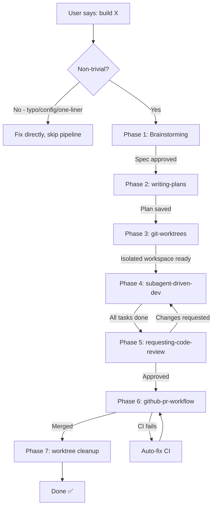

# HA-POWERS — Full-Stack Development Pipeline

> **HA-POWERS** is inspired by [obra's Superpowers](https://github.com/obra/superpowers) — the progressive disclosure pattern that started it all. The name pays homage to that original work.
>
> **HA-POWERS = Hermes Agent Superpowers.**

## Pipeline Overview



## Phase Gates

> ⚠️ **STARTUP PROTOCOL:** When you load ha-powers and identify a feature to build, **immediately show this Phase Gates table to the user**. Users expect visible checkpoints/progress milestones — don't start building without setting expectations. The table IS the "progress checklist" they're asking about. If they then ask "what about kanban", kanban is the fine-grained task tracker inside Phase 4; the phase gates are the macro-level milestones.

Each phase has a **gate** that must pass before the next phase starts:

| Phase | Gate Condition | Output Artifact |
|-------|---------------|-----------------|
| 1. Brainstorming | User approves written spec | `<project>/docs/specs/<date>-<topic>-design.md` |
| 2. Writing Plans | Plan saved and committed | `<project>/docs/plans/<date>-<topic>-plan.md` |
| 3. Git Worktrees | Worktree created, tests green | Isolated `./worktrees/feat/<name>` |
| 4. Subagent Dev | All tasks complete, tests pass | Feature code on branch |
| 5. Code Review | Review approved (or issues fixed) | Reviewed code |
| 6. PR + CI | PR merged | Closed PR + deleted branch |
| 7. Cleanup | Worktree removed | Clean main checkout |

## 🧠 Design Philosophy — Why This Exists

> **The core question:** Why a 7-phase pipeline with gates, when you could just "start coding"?

### The Problem We're Solving

Without a structured pipeline, AI-assisted development has three chronic failures:

| Failure Mode | What Happens | How HA-POWERS Fixes It |
|-------------|-------------|----------------------|
| **Building the wrong thing** | Jump straight to code → realize later the spec was misunderstood → rewrite everything | Phase 1 (Brainstorming) forces a written spec and user approval BEFORE any code exists |
| **Unpredictable effort** | "It's just a small feature" → 3 days later → nothing done | Phase 2 (Writing Plans) decomposes everything into 2–5 minute tasks with exact file paths and commands |
| **No accountability** | Changes happen in the void → no review → bugs ship | Phase 5 (Code Review) + Phase 6 (PR + CI) create a mandatory quality gate before merging |

### Why 7 Phases?

Each phase solves a specific failure mode. They are **sequential and gated** — you cannot proceed until the current phase produces its artifact:

| Phase | Solves | Gate Output |
|-------|--------|-------------|
| 1. Brainstorming | "We built the wrong thing" | Approved design spec |
| 2. Writing Plans | "I don't know where to start" | Task list with exact file paths |
| 3. Git Worktrees | "My main branch is messy" | Isolated workspace |
| 4. Subagent Dev | "Coding without TDD is gambling" | Feature code + passing tests |
| 5. Code Review | "I missed bugs in my own code" | Human-quality audit |
| 6. PR + CI | "Changes went straight to main" | Merged PR with green CI |
| 7. Cleanup | "Git history is full of abandoned branches" | Clean main checkout |

**The gates are the key.** Each phase must produce a tangible artifact before the next begins. This prevents the common anti-pattern of "just start coding" — the kind of thinking that creates the most expensive rework.

### What HA-POWERS Adds on Top of Superpowers

[obra's Superpowers](https://github.com/obra/superpowers) pioneered the progressive-disclosure skill pattern. HA-POWERS builds on it by adding:

- **Orchestration layer** — Superpowers provides individual skills (brainstorming, writing-plans, etc.). HA-POWERS provides the **pipeline** that sequences them with gates.
- **Progress Tracker** — A visible checklist that shows exactly where you are in the process. Addresses the "am I done?" anxiety.
- **Phase Gates** — Explicit conditions that must be met before moving forward. Prevents skipping critical steps.
- **Single-profile architecture** — One Hermes profile (default) handles all 7 phases. Only Phase 4 may spawn 0–2 transient subagents. No need for 6 separate profiles.
- **Kanban integration** — Optional visual board for multi-feature visibility. The pipeline works identically with or without it.
- **Decision tree** — Automatic detection of when to run the full pipeline vs. skip to a quick fix.

### The Guiding Principle

> **Every feature, every time, from idea to merged PR, with no steps skipped.**

This isn't bureaucracy — it's **insurance against your future self forgetting why you made a decision today**. The spec, the plan, the PR description — they're all artifacts you (or your reviewer) will thank you for later.

---

## Progress Tracker

> 📋 **Show this tracker at the START of every feature.** Update checkboxes as each phase completes. This is the "superpowers-style" progress tracking you asked for.

**Naming convention:** Always call it "Progress Tracker" (not "Task Tracker", "Checklist", or "Todo List"). Emphasizes step-by-step progress within a single feature development.

```
## 🚧 Progress Tracker

### Phase 1: Brainstorming
- [ ] Explore context & codebase
- [ ] Ask clarifying questions
- [ ] Propose 2-3 approaches
- [ ] Present design & architecture
- [ ] Write spec to `<project>/docs/specs/`
- [ ] Self-review spec (no placeholders)
- [ ] User approves spec ✅

### Phase 2: Writing Plans
- [ ] Read approved spec
- [ ] Explore codebase patterns
- [ ] Write tasks (2-5 min each)
- [ ] Include exact file paths
- [ ] Include TDD cycle for each task
- [ ] Review plan completeness
- [ ] Save to `<project>/docs/plans/` ✅

### Phase 3: Git Worktrees
- [ ] Detect existing worktree
- [ ] Create worktree on feat/<name>
- [ ] Install dependencies
- [ ] Verify clean test baseline
- [ ] Isolated workspace ready ✅

### Phase 4: Subagent Dev
- [ ] Read plan, extract tasks
- [ ] Decide subagent count
- [ ] Dispatch Developer subagent(s)
- [ ] Dispatch Reviewer subagent(s) (large features)
- [ ] Fix issues → re-review loop
- [ ] All tasks complete
- [ ] Final integration check ✅

### Phase 5: Code Review
- [ ] Review correctness
- [ ] Review maintainability
- [ ] Review security
- [ ] Review performance
- [ ] Review testing coverage
- [ ] Report findings (severity)
- [ ] Fix issues → re-review ✅

### Phase 6: PR + CI
- [ ] Push branch to GitHub
- [ ] Create PR with description
- [ ] Monitor CI status
- [ ] Auto-fix CI failures (up to 3)
- [ ] Merge (squash + delete branch) ✅

### Phase 7: Cleanup
- [ ] Remove local worktree
- [ ] Switch back to main
- [ ] Clean up branches
- [ ] Feature delivered ✅
```

**Rules:**
1. Show tracker immediately when pipeline starts
2. Update `[ ]` → `[x]` as each step completes
3. Add emoji: ✅ done, 🔄 in progress, ⏸️ blocked
4. Keep it visible throughout the session
5. For small features, skip phases as needed (Decision Tree)

> 💡 **Terminology clarity:**
> - **HA-POWERS** = Brand name (homage to obra's Superpowers)
> - **Pipeline** = The actual mechanism — fixed sequential stages (7 phases)
> - **Workflow** = The decision layer above the pipeline (should we run it? which path?)
> - **Kanban** = A separate visual tracking tool for multi-feature visibility
> 
> The Pipeline is INSIDE the Workflow. Kanban runs alongside both.

### Naming Conventions (Critical)

> ⚠️ **Name is `ha-powers` (plural), NOT `ha-power`.** The skill directory, frontmatter `name:` field, and `@skill:ha-powers` command all use the plural form. This was changed from the original `ha-power` to match the Superpowers homage. Always use `ha-powers` consistently.

> ⚠️ **Always call it "Progress Tracker"** (not "Task Tracker", "Checklist", or "Todo List"). Emphasizes step-by-step progress within a single feature development.

## When to Use This Pipeline

**YES — use full pipeline when:**
- User says "build a [feature/component/app]"
- Multi-step coding task with >2 files
- Task involves architecture decisions
- Task has test implications
- Any project where the user might want a PR trail

**NO — skip pipeline (handle directly) when:**
- Fixing a single-line typo
- Changing a config value
- Running a script
- Trivial rename / formatting
- User explicitly says "just do it, no need for planning"

## Phase Details

### Phase 1: Brainstorming
*Skill: `brainstorming`*

Goal: Turn a fuzzy idea into a concrete, approved spec.

1. **Explore context** — read existing files, understand the codebase
2. **Ask clarifying questions** — one at a time. Purpose? Constraints? Success criteria?
3. **Propose 2-3 approaches** — with trade-offs and a recommendation
4. **Present design** — architecture, components, data flow, testing strategy
5. **User approves** → write spec to `<project>/docs/specs/<date>-<topic>-design.md`
6. **Self-review spec** — check for placeholders, contradictions, ambiguity
7. **User reviews final spec** — wait for explicit approval

> **Gate output:** Approved spec document.  
> **Next:** Invoke `writing-plans` skill.

### Phase 2: Writing Plans
*Skill: `writing-plans`*

Goal: Decompose the approved spec into bite-sized, implementable tasks.

1. **Read the spec** thoroughly
2. **Explore the codebase** — understand existing patterns
3. **Write each task** with:
   - One sentence objective
   - Exact file paths (Create:/Modify:/Test:)
   - Complete TDD cycle (failing test → implement → passing test → commit)
   - Exact commands with expected output
4. **Review the plan**:
   - [ ] Tasks are 2-5 minutes each
   - [ ] All file paths are exact
   - [ ] Code examples are copy-pasteable
   - [ ] Verification steps are explicit
5. **Save plan** to `<project>/docs/plans/<date>-<topic>-plan.md` and commit

> **Gate output:** Implementation plan with N sequential tasks.  
> **Next:** Ask user if they want isolated workspace → invoke `git-worktrees` (or skip to Phase 4 if declined).

### Phase 3: Git Worktrees
*Skill: `git-worktrees`*

Goal: Create an isolated working directory so the main branch stays clean.

1. **Detect** if already in a worktree (skip if so)
2. **Ask** user for consent (honor existing preference without asking)
3. **Create worktree** on `feat/<feature-name>` branch:
   ```bash
   git worktree add .worktrees/feat/<name> -b feat/<name>
   cd .worktrees/feat/<name>
   ```
4. **Project setup** — auto-detect and install deps
5. **Verify clean test baseline** — run full suite, report pass/fail

> **Gate output:** Isolated workspace at `.worktrees/feat/<name>` with passing tests.  
> **Next:** Execute plan via `subagent-driven-development`.

### Phase 4: Subagent-Driven Development
*Skill: `subagent-driven-development`*

Goal: Execute the plan task-by-task. Only phase that may spawn subagents.

1. **Read the plan** once, extract all tasks
2. **Create todo list**
3. **Decide subagent count** based on feature size:
   - **Small (1-3 files):** 1 Developer subagent, no Reviewer
   - **Large (cross-module):** 1 Developer + 1 Reviewer (combined spec+quality)
4. **For each task** (sequential for same-file tasks, parallel for independent ones):
   - **Dispatch Developer subagent** — full task context, TDD instructions
   - **(Large only) Dispatch Reviewer subagent** — verify against spec + quality
   - **Fix issues** → re-review if needed → mark complete
5. **Final integration check** — all components work together?

> **Gate output:** Feature fully implemented on the worktree branch, all tests passing.  
> **Next:** Ask user if they want a full code review → invoke `requesting-code-review`.

### Phase 5: Requesting Code Review
*Skill: `requesting-code-review`*

Goal: Final human-quality review before opening a PR.

1. **Review all changed files** for:
   - Correctness: logic errors, edge cases?
   - Maintainability: clear naming, comments, structure?
   - Security: injection, auth, data exposure?
   - Performance: N+1 queries, memory leaks?
   - Testing: adequate coverage?
2. **Report findings** with severity (Critical / Important / Minor)
3. **Fix issues** → re-review → approve

> **Gate output:** Reviewed code ready for PR.  
> **Next:** Open PR via `github-pr-workflow`.

### Phase 6: GitHub PR Workflow
*Skill: `github-pr-workflow`*

Goal: Open, monitor, and merge a PR.

1. **Push branch** to GitHub:
   ```bash
   git push -u origin HEAD
   ```
2. **Create PR** with structured description
3. **Monitor CI** — poll until complete
4. **Auto-fix CI failures** (up to 3 attempts)
5. **Merge** (squash + delete branch)

> **Gate output:** Merged PR, remote branch deleted.  
> **Next:** Clean up local worktree.

### Phase 7: Cleanup
*No dedicated skill — inline step.*

Goal: Remove the local worktree and switch back to main.

```bash
git checkout main && git pull origin main
git worktree remove .worktrees/feat/<name>
git branch -d feat/<name>   # if merged
```

> **Final state:** Clean main checkout, feature delivered. ✅

## Decision Tree (Quick Reference)

```
User says "build X"
├─ Is it a single-line fix / config change / typo?
│   └─ YES → Fix directly. Skip pipeline.
│
├─ Is it a clear bug with known root cause?
│   └─ YES → Use systematic-debugging skill. Skip brainstorming + plans.
│
├─ Is it a non-trivial new feature / component?
│   └─ YES → Run full pipeline:
│       Phase 1: brainstorming → spec
│       Phase 2: writing-plans → task list
│       Phase 3: git-worktrees → isolated workspace
│       Phase 4: subagent-driven-dev → implementation
│       Phase 5: requesting-code-review → approval
│       Phase 6: github-pr-workflow → PR → merge
│       Phase 7: cleanup → done
│
├─ User says "I don't need isolation" or "just do it here"?
│   └─ Skip Phase 3 (worktrees). Work in-place.
│
└─ User says "I don't need a PR"?
    └─ Skip Phase 6 (PR). Commit to feature branch directly.
```

## Common Mistakes

- **Skipping brainstorming for "simple" features** — this is the #1 anti-pattern. Simple features hide the most assumptions.
- **Writing plans without reading the spec** — the plan must trace back to approved requirements.
- **Creating worktree inside a worktree** — Phase 3's detection step prevents this.
- **Skipping spec compliance review** — TDD catches bugs, but spec review catches building the wrong thing.
- **Merging before CI is green** — always verify.
- **Spawning too many subagents** — you don't need separate agents for Architect/Planner/DevOps. Orchestrator handles 6 of 7 phases directly. Only Phase 4 may benefit from 1-2 subagents. More is just overhead.
- **Leaving worktrees around after merge** — run Phase 7 or they accumulate.
- **Worktree requires fully tracked project** — Before creating a worktree, check `git status --short`. If the project has critical untracked files (`??` entries like `static/`, `data/`, `config/`) that you need in the workspace, `git worktree add` won't bring them. You'll end up with a bare branch. **Why:** `git worktree add` checks out files from git history only — it has no knowledge of untracked files on disk. The main repo may have them but the worktree is a fresh checkout. **Fix:** either `git add` + commit the essential files first, or skip worktrees and work on a branch directly. If the user asks why it's empty, explain: "worktree is a checkout from git, not a copy of your working directory."
- **Keeping legacy standalone profiles from old architecture** — If you find leftover profiles (e.g., `coder`, `architect`, `planner`) in your Hermes profiles directories, they're remnants from an earlier 6-agent-role concept that HA-POWERS has replaced. This pipeline runs entirely from **one profile** (default) with 0-2 transient subagents via `delegate_task()` — independent profiles per role are unnecessary overhead. Delete them with `rm -rf <profile-dir>` after verifying nothing references them.

## ⚡ Key Concept: Profile ≠ Subagent

> 🎯 **One profile = full pipeline.** Not 6 profiles, not 6 agents.
>
> | Term | Definition | Lifetime | Independent |
> |------|-----------|----------|-------------|
> | **Profile** | A complete Hermes configuration (skills/plugins/cron/memories/API keys) | Permanent | Has its own identity |
> | **Subagent** | A temporary child process spawned via `delegate_task` | Minutes (disposable) | Inherits parent profile's everything |
> | **Session** | Your ongoing conversation with Hermes | Chat duration | Conversation history |
>
> **One Hermes profile (default) runs the entire HA-POWERS pipeline.** All subagents are transient children under it — they don't need their own profile, don't persist, and don't have independent memory.

## Multi-Agent Collaboration

> For the complete architecture, agent contracts, and code examples → load `references/multi-agent-architecture.md`

> For public documentation reference → `references/public-docs.md` (mirrors https://github.com/bj9421/HA-POWERS-Docs)

ha-powers uses **at most 0–2 subagents** for real work. The 6 "roles" from earlier documentation were misleading — they're **task types executed by the same Orchestrator session**, not separate agents.

```
                 ┌──────────────────────────────────┐
                 │  ORCHESTRATOR (你 + Hermes)        │  ← 1 profile (default)
                 │  Handles ALL phases directly:      │
                 │  • Phase 1: Talk to you (spec)     │
                 │  • Phase 2: Write plan             │
                 │  • Phase 3: git worktree           │
                 │  • Phase 5: lint/security checks   │
                 │  • Phase 6: git push / gh pr       │
                 │  • Phase 7: cleanup                │
                 └──────────────┬───────────────────┘
                                │
                  ONLY Phase 4: │ delegate_task
                                ▼
                 ┌──────────────────────────────────┐
                 │  1–2 SUBAGENTS (temporary)         │
                 │  ┌────────────┐  ┌────────────┐  │
                 │  │ Developer  │  │ Reviewer   │  │
                 │  │ (code)     │  │ (audit)    │  │
                 │  └────────────┘  └────────────┘  │
                 │  • Born from delegate_task         │
                 │  • Die after delivering report     │
                 │  • Same profile as Orchestrator    │
                 │  • No persistent state             │
                 └──────────────────────────────────┘
```

### When to Spawn Subagents

| Phase | Needs Subagent? | Why |
|-------|----------------|------|
| 1. Brainstorming | ❌ — Talk to user directly | Spec discussion, not coding |
| 2. Writing Plans | ❌ — Write it yourself | Fast to write, slow to delegate |
| 3. Git Worktrees | ❌ — CLI command | `git worktree add` is one line |
| **4. Development** | **🟢 1 Developer** — real coding | Isolated TDD workload |
| **4. Review** | **🟢 1 Reviewer (optional)** — large features only | Small tasks: self-review and go |
| 5. Quality Gates | ❌ — CLI commands | Lint/security scan, one-liners |
| 6. PR | ❌ — CLI commands | `git push && gh pr create` |
| 7. Cleanup | ❌ — CLI command | `git worktree remove` |

### Subagent Dispatch (Phase 4 Only)

```python
# Small feature (1-3 files): 1 Developer only
delegate_task(
    goal="Implement task N from plan: <task>",
    context=f"Worktree: {path}, TDD required, exact file list",
    toolsets=['terminal', 'file']
)

# Large feature (cross-module): 1 Developer + 1 Reviewer
# Step 1: Developer implements
# Step 2: Reviewer audits (spec compliance + code quality, merged into 1)
delegate_task(
    goal="Verify implementation matches spec: <spec path>",
    context=f"Files changed, spec requirements, quality checklist",
    toolsets=['file']
)
```

### Collaboration Patterns

| Pattern | When | How |
|---------|------|-----|
| **Sequential handoff** | Default, safest | Each phase → artifact → next phase |
| **Parallel developers** | Tasks touch different files | `delegate_task(tasks=[...])` up to 3 at once |
| **Reviewer loop** | Reviewer finds issues | Fix → re-dispatch reviewer → repeat until PASS |
| **Cron monitor** | CI/deployment waiting | `cronjob(schedule='5m', script=ci_poller)` |

> ✅ Orchestrator handles 6 of 7 phases directly — only Phase 4 may spawn subagents.  
> ✅ All subagents share the **same Hermes profile** (default) — no profile isolation needed.  
> ✅ Artifacts pass through **shared filesystem** (git commits, spec docs, test results).

## Kanban Integration (File-Based Board)

> **Kanban is entirely optional.** Every phase in the pipeline runs identically with or without it. Kanban adds visual task tracking for multi-session or multi-feature visibility, but is zero overhead to skip — the pipeline never blocks on a kanban command. Use it when you want a persistent board; ignore it when you don't.

> Kanban skill must be loaded separately — `skill_view('kanban')` for full docs.  
> Data stored in `KANBAN.json` at your project root. Zero dependencies.

### Pipeline ↔ Kanban Mapping

| Phase | Kanban Action | Watches For |
|-------|--------------|-------------|
| 1. Brainstorming | `kanban add "Feature:..." --col backlog` | User approves spec |
| 2. Writing Plans | `kanban move K1 --col todo` | Plan committed |
| 4. Subagent Dev | `kanban move K1 --col doing` | Subagent dispatched |
| 4. Developer done | `kanban log K1 "✅ Dev complete"` | Tests pass |
| 4. Per-task review | `kanban log K1 "🔍 Spec PASS"` / `kanban log K1 "🔍 Quality APPROVED"` | Both reviews pass |
| 4. Task done | `kanban move K1 --col review` | All tasks implemented |
| 5. Code Review | `kanban move K1 --col review` → `kanban move K1 --col done` | Review approved |
| 6. PR Merged | `kanban log K1 "🔀 PR #42 merged"` | CI green, merged |
| 7. Cleanup | `kanban archive --days 7` | Weekend cleanup |

> **Multi-card variant:** For features with 3+ clearly independent tasks (e.g., "CSS layout", "JS logic", "Test"), create one card per task instead of one card for the feature. Each card tracks through the same columns independently. Add a feature-level card in the board description or as a parent note. This gives finer visibility especially when tasks move at different speeds. |

### Auto-Tracking Commands (Reference)

```bash
# At start of Phase 4
kanban add "Task 1: User model" --col todo --prio P1
kanban add "Task 3: Auth middleware" --col todo --prio P1

# When dispatching subagent
kanban move K1 --col doing
kanban log K1 "🔄 Starting Phase 4 → dispatching Developer"

# When review passes
kanban log K1 "✅ Spec compliance: PASS"
kanban log K1 "✅ Quality review: APPROVED"

# When task finishes
kanban move K1 --col done

# Weekly board export
kanban board --output docs/kanban-board.md
```

### Why File-Based Works on RPi

- **Zero deps** — pure Python stdlib, no server, no DB
- **Git-native** — `KANBAN.json` is versioned with code
- **Offline** — works without internet (RPi edge mode)
- **Programmable** — Hermes reads/writes it via terminal
- **Observable** — `kanban list` prints to Telegram
- **Integrates** — `kanban board` exports to Obsidian

### When Orchestrator Should Use Kanban

| Situation | Use Kanban? |
|-----------|------------|
| ha-powers full pipeline | ✅ Yes — track every task |
| Quick fix / one-liner | ❌ No — skip |
| Multi-sprint project | ✅ Yes — persistent tracking |
| Research / exploration | Optional — backburner cards |
| Single dev, small project | Optional — but recommended for habit |

When the user says something like "I want to build a...", "Can you add...", "Let's create a...":

```python
# This is the entry point. The pipeline auto-detects when to load.
# The orchestrator (you) runs each phase in order, loaded from these skills.
# You don't need to write code — just follow the Phase flow above.
pass
```

The `ha-powers` skill itself is **declarative orchestration** — it tells you which skill to load at each phase. Load the sub-skill for implementation details when you reach that phase.

## Version History

| Version | Date | Change |
|---------|------|--------|
| 1.0.0 | 2026-07-08 | Initial orchestrator skill, 7-phase pipeline |
| 1.1.0 | 2026-07-09 | Added Progress Tracker, Phase Gates, Kanban integration |
| 1.3.0 | 2026-07-09 | Added Design Philosophy section explaining why the 7-phase pipeline exists, what problems it solves, and what HA-POWERS adds on top of obra's Superpowers |

> ⚠️ **Name change notice:** Originally `ha-power`, renamed to `ha-powers` (plural) to better match the Superpowers homage. All references must use `ha-powers` going forward: skill directory, frontmatter `name:`, `@skill:ha-powers` command, and all docs.


**HA-POWERS = Every feature, every time, from idea to merged PR, with no steps skipped.**  
Load this skill and follow the phases. Each phase gates to the next. Never guess what comes next.
