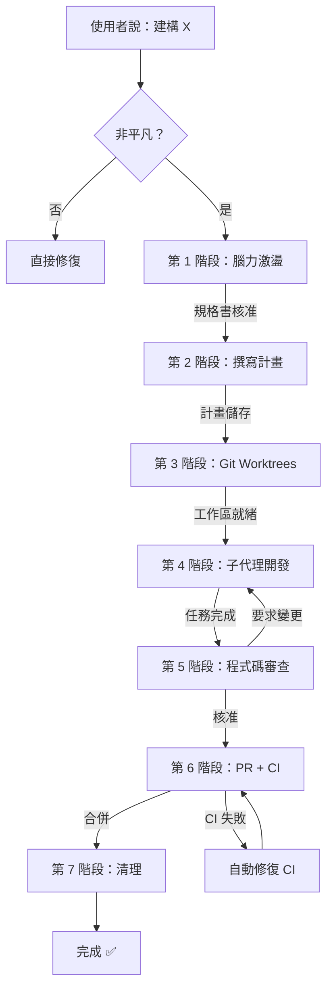

# HA-POWERS — 全棧開發管線

> **HA-POWERS** 靈感來自 [obra 的 Superpowers](https://github.com/obra/superpowers)。  
> 
>
> 🇹🇼 [English Version](README.md)

> **HA-POWERS = Hermes Agent Superpowers。**  
> 從原始構想到合併 PR 的完整開發管線，專為 Hermes Agent 設計，但也適用於任何 AI 輔助的工作流程。

## 🚀 快速開始


## 📦 安裝與使用

> ⚠️ **非 Hermes Agent 內建。** 這是社群貢獻的 skill，由 Hermes 使用者自行編寫，並非 Hermes Agent 核心發行版的一部分。

HA-POWERS 以 **Hermes Agent skill** 形式提供。無需額外安裝 — 將 skill 放入 `skills/` 目錄即可使用。

> 🤖 **給 Agent 使用：** [下載 SKILL.md](SKILL.md) + [references/](references/) — 將**整個目錄**（`SKILL.md` + `references/`）複製到 `skills/software-development/ha-powers/` 目錄即可部署完整的 skill 定義。`references/` 包含 skill 依賴的支援文件。

### 前置條件

- 已安裝並運行 Hermes Agent
- 已連接至提供者（Anthropic、OpenRouter 等）

### 使用方法

有**兩種方式**執行 HA-POWERS：

#### 選項 1：載入 Skill（推薦）

在任何 Hermes 對話中輸入：

```
@skill:ha-powers
```

這會載入 `ha-powers` skill 並啟動完整管線。你會看到進度追蹤器，並被引導完成每個階段。

#### 選項 2：讓 Hermes 自動偵測

當你說「建構 X」或「實作一個功能」時，已載入 ha-power skill 的 Hermes 會**自動**決定是要執行管線還是跳過到快速修復。無需手動載入 — 只需描述你想要的。

### 接下來會發生什麼

載入後，HA-POWERS 會：

1. 向你顯示**進度追蹤器**（7 個階段）
2. 引導你完成**腦力激盪** → **計畫** → **開發** → **審查** → **PR** → **清理**
3. 每完成一個階段就更新核取方塊
4. 在 `docs/specs/`、`docs/plans/` 和你的 git worktrees 中建立產物

### 選配：Kanban 看板

如需跨會話的多功能追蹤，也載入 kanban skill：

```
@skill:kanban
```

然後使用 kanban 指令，例如：
```
kanban add "我的功能" --col backlog
kanban move K1 --col todo
kanban list
```

更多資訊請參閱 [Kanban skill 文件](https://github.com/bj9421/HA-POWERS-Docs)。

當使用者說「建構 X」時，HA-POWERS 會決定是否要執行完整管線，還是直接跳過到快速修復：

```
使用者說「建構 X」
├─ 單行修復 / 設定變更 / 錯字？
│   └─ 是 → 直接修復。跳過管線。
├─ 已知根因的明確 bug？
│   └─ 是 → 使用 systematic-debugging。跳過腦力激盪 + 計畫。
└─ 非平凡的新功能？
    └─ 是 → 執行完整 7 階段管線
```

## 📋 管線總覽



## 🧠 設計理念 — 為什麼要這樣做

> **核心問題：** 為什麼要有 7 階段管線加上檢查閥門，而不是直接「開始寫程式」？

### 我們要解決的問題

沒有結構化的開發流程，AI 輔助開發有三個慢性問題：

| 問題模式 | 發生什麼事 | HA-POWERS 怎麼解決 |
|---------|-----------|------------------|
| **做出錯誤的東西** | 直接寫程式 → 後來發現規格理解錯誤 → 全部重寫 | 第 1 階段（腦力激盪）強制在寫任何程式碼之前，先產出書面規格並獲得用戶批准 |
| **無法預測工作量** | 「只是小功能」→ 三天後 → 什麼都沒完成 | 第 2 階段（撰寫計畫）把一切拆解成 2–5 分鐘的任務，每個都有精確的檔案路徑和指令 |
| **沒有責任歸屬** | 變更在真空中發生 → 沒有審核 → bug 上線 | 第 5 階段（程式碼審查）+ 第 6 階段（PR + CI）在合併前建立強制品質關卡 |

### 為什麼是 7 個階段？

每個階段解決一個特定的問題模式。它們是**順序且帶閥門的** — 當前階段必須產出其工件，才能進入下一階段：

| 階段 | 解決 | 閥門產出物 |
|-------|------|-----------|
| 1. 腦力激盪 | 「我們做出了錯誤的東西」 | 批准的設計規格 |
| 2. 撰寫計畫 | 「不知道從哪裡開始」 | 帶有精確檔案路徑的任務列表 |
| 3. Git Worktrees | 「主分支變得髒亂」 | 隔離工作區 |
| 4. Subagent 開發 | 「不用 TDD 寫程式就像賭博」 | 功能程式碼 + 通過測試 |
| 5. 程式碼審查 | 「我錯過了自己程式碼中的 bug」 | 人工品質審查 |
| 6. PR + CI | 「變更直接合入 main」 | 已合併的 PR + 綠色 CI |
| 7. 清理 | 「Git 歷史充滿遺棄的分支」 | 乾淨的主分支檢出 |

**閥門是關鍵。** 每個階段必須產生具體的工件，才能進入下一步。這防止了常見的「直接開始寫程式」反模式 — 這種想法會造成最昂貴的返工。

### HA-POWERS 在 Superpowers 之上加了什麼

[obra 的 Superpowers](https://github.com/obra/superpowers) 開創了漸進式揭露技能的模式。HA-POWERS 在其基礎上添加：

- **協調層** — Superpowers 提供個別技能（brainstorming、writing-plans 等）。HA-POWERS 提供**帶有閥門的管線**來排序它們。
- **進度追蹤器** — 可見的檢查清單，顯示你在流程中的確切位置。解決「我完成了嗎？」的不安感。
- **階段閥門** — 明確的條件，必須滿足才能繼續。防止跳過關鍵步驟。
- **單一 Profile 架構** — 一個 Hermes profile（default）處理所有 7 個階段。只有第 4 階段可能會產生 0–2 個暫時性 subagent。不需要 6 個獨立的 profile。
- **Kanban 整合** — 可選的視覺化看板，用於多功能可見性。有或沒有它，管線運作方式相同。
- **決策樹** — 自動偵測何時執行完整管線 vs. 跳過到快速修復。

### 指導原則

> **每一個功能，每一次，從構想到合併 PR，不跳過任何步驟。**

這不是官僚主義 — 這是**防止未來的自己忘記今天做了什麼決定的保險**。規格、計畫、PR 描述 — 這些都是工件，你（或你的審查者）將來會感謝它們的存在。

---

## 🚧 進度追蹤器

每項新功能在**開始時**顯示此追蹤器。每完成一個階段就打勾。

### 第 1 階段：腦力激盪
- [ ] 探索脈絡與程式碼庫
- [ ] 提出釐清問題
- [ ] 提出 2-3 種方法
- [ ] 展示設計與架構
- [ ] 撰寫規格書至 docs/specs/
- [ ] 自我審查規格書（不留佔位符）
- [ ] 使用者核准規格書 ✅

### 第 2 階段：撰寫計畫
- [ ] 閱讀已核准的規格書
- [ ] 探索程式碼庫模式
- [ ] 撰寫任務（每個 2-5 分鐘可完成）
- [ ] 包含精確的檔案路徑
- [ ] 每個任務都包含 TDD 循環
- [ ] 審查計畫完整性
- [ ] 儲存至 docs/plans/ ✅

### 第 3 階段：Git Worktrees
- [ ] 偵測現有的 worktree
- [ ] 在 feat/<name> 建立 worktree
- [ ] 安裝相依套件
- [ ] 驗證測試基準乾淨
- [ ] 隔離工作區就緒 ✅

### 第 4 階段：子代理開發
- [ ] 閱讀計畫，提取任務
- [ ] 決定子代理數量
- [ ] 派遣開發者子代理
- [ ] 派遣審查者子代理（大型功能）
- [ ] 修復問題 → 重新審查循環
- [ ] 所有任務完成
- [ ] 最終整合檢查 ✅

### 第 5 階段：程式碼審查
- [ ] 審查正確性
- [ ] 審查可維護性
- [ ] 審查安全性
- [ ] 審查效能
- [ ] 審查測試覆蓋率
- [ ] 報告發現（嚴重程度）
- [ ] 修復問題 → 重新審查 ✅

### 第 6 階段：PR + CI
- [ ] 推送分支至 GitHub
- [ ] 建立帶有描述的 PR
- [ ] 監控 CI 狀態
- [ ] 自動修復 CI 失敗（最多 3 次）
- [ ] 合併（squash + 刪除分支）✅

### 第 7 階段：清理
- [ ] 移除本地 worktree
- [ ] 切換回 main
- [ ] 清理分支
- [ ] 功能交付完成 ✅

## 📊 階段閥門

每個階段都有一個**閥門**，必須通過才能進入下一個階段：

| 階段 | 閥門條件 | 輸出產物 |
|------|---------|---------|
| 1. 腦力激盪 | 使用者核准書面規格 | `docs/specs/<日期>-<主題>-設計.md` |
| 2. 撰寫計畫 | 計畫已儲存並提交 | `docs/plans/<日期>-<主題>-計畫.md` |
| 3. Git Worktrees | worktree 已建立，測試通過 | 隔離的 `./worktrees/feat/<名稱>` |
| 4. 子代理開發 | 所有任務完成，測試通過 | 分支上的功能程式碼 |
| 5. 程式碼審查 | 審查通過 | 已審查的程式碼 |
| 6. PR + CI | PR 已合併 | 關閉的 PR + 已刪除的分支 |
| 7. 清理 | worktree 已移除 | 乾淨的 main 簽出 |

## 🎯 架構哲學

### 一個 Profile，不是多個

> 🎯 **一個 profile = 完整管線。** 不是 6 個 profile，不是 6 個代理。

| 術語 | 定義 | 壽命 | 獨立性 |
|------|-----|------|--------|
| **Profile** | 完整的 Hermes 設定 | 永久 | 有自己的身份 |
| **Subagent** | 暫時的子程序 | 幾分鐘（一次性） | 繼承父 profile |
| **Session** | 持續的對話 | 聊天期間 | 對話歷史 |

**一個 Hermes profile 執行整個 HA-POWERS 管線。** 所有 subagent 都是暫時的子程序 —— 它們不需要自己的 profile。

### 最小化 Subagent

HA-POWERS 僅在實際工作需要時使用**最多 0–2 個 subagent**：

```
                 ┌──────────────────────────────────┐
                 │  協調者（你 + Hermes）              │  ← 1 個 profile
                 │  直接處理所有階段：                  │
                 │  • 第 1 階段：與使用者交談（規格）    │
                 │  • 第 2 階段：撰寫計畫               │
                 │  • 第 3 階段：git worktree           │
                 │  • 第 5 階段：lint/安全檢查          │
                 │  • 第 6 階段：git push / gh pr       │
                 │  • 第 7 階段：清理                   │
                 └──────────────┬───────────────────┘
                                │
                  僅第 4 階段： │ delegate_task
                                ▼
                 ┌──────────────────────────────────┐
                 │  1–2 個子代理（暫時的）              │
                 │  ┌────────────┐  ┌────────────┐  │
                 │  │ 開發者     │  │ 審查者     │  │
                 │  │ （程式碼） │  │ （稽核）   │  │
                 │  └────────────┘  └────────────┘  │
                 │  • 由 delegate_task 產生           │
                 │  •  delivering report 後消失       │
                 │  • 與協調者相同的 profile          │
                 │  • 無持久狀態                      │
                 └──────────────────────────────────┘
```

| 階段 | 需要 Subagent？ | 原因 |
|------|----------------|------|
| 1. 腦力激盪 | ❌ | 直接與使用者交談 |
| 2. 撰寫計畫 | ❌ | 寫計畫很快，委派很慢 |
| 3. Git Worktrees | ❌ | `git worktree add` 一行搞定 |
| **4. 開發** | **🟢 1 個開發者** | 隔離的 TDD 工作量 |
| **4. 審查** | **🟢 1 個審查者（選配）** | 僅大型功能 |
| 5. 品質閥門 | ❌ | CLI 命令 |
| 6. PR | ❌ | `git push && gh pr create` |
| 7. 清理 | ❌ | `git worktree remove` |

## 📋 Kanban 整合

Kanban 是**完全選配的**。無論有沒有它，每個階段都以相同的方式執行。

### 管線 ↔ Kanban 對應

| 階段 | Kanban 動作 | 監視 |
|------|------------|------|
| 1. 腦力激盪 | `kanban add "功能..." --col backlog` | 使用者核准規格 |
| 2. 撰寫計畫 | `kanban move K1 --col todo` | 計畫已提交 |
| 4. 子代理開發 | `kanban move K1 --col doing` | 子代理已派遣 |
| 4. 開發者完成 | `kanban log K1 "✅ 開發完成"` | 測試通過 |
| 4. 逐任務審查 | `kanban log K1 "🔍 規格 PASS"` | 兩次審查都通過 |
| 4. 任務完成 | `kanban move K1 --col review` | 所有任務已實作 |
| 5. 程式碼審查 | `kanban move K1 --col review` → `--col done` | 審查通過 |
| 6. PR 合併 | `kanban log K1 "🔀 PR #42 已合併"` | CI 綠色，已合併 |
| 7. 清理 | `kanban archive --days 7` | 週末清理 |

### 為什麼基於檔案的設計適合邊緣裝置

- **零相依性** — 純 Python stdlib，無需伺服器、無需資料庫
- **Git 原生** — `KANBAN.json` 與程式碼一起版本控制
- **離線可用** — 無需網路即可運作（edge 模式）
- **可程式化** — Hermes 透過終端機讀寫
- **可觀察** — `kanban list` 列印到 Telegram
- **可整合** — `kanban board` 匯出到 Obsidian

## 🔧 使用時機

### 是 — 使用完整管線：
- 使用者說「建構一個 [功能/元件/應用程式]」
- 多步驟程式碼任務，涉及 >2 個檔案
- 任務涉及架構決策
- 任務有測試影響
- 任何你想要 PR 軌跡的專案

### 否 — 跳過管線（直接處理）：
- 修復單行錯字
- 更改設定值
- 執行腳本
- 微不足道的重新命名 / 格式化
- 使用者明確說「直接做就好，不需要計畫」

## 📁 專案結構

```
project-root/
├── docs/
│   ├── specs/          # 第 1 階段輸出
│   │   └── 2026-07-09-功能設計.md
│   └── plans/          # 第 2 階段輸出
│       └── 2026-07-09-功能計畫.md
├── .worktrees/
│   └── feat/           # 第 3 階段輸出
│       └── 功能名稱/
├── KANBAN.json         # 選配 Kanban 看板
└── src/                # 實作
```

## 🚫 常見錯誤

1. **為「簡單」功能跳過腦力激盪** — 這是第一號反模式。簡單的功能隱藏最多的假設。
2. **未閱讀規格書就寫計畫** — 計畫必須追溯到已核准的需求。
3. **在 worktree 內建立 worktree** — 第 3 階段的偵測步驟可防止此問題。
4. **跳過規格符合性審查** — TDD 捕捉錯誤，但規格審查捕捉「做錯東西」。
5. **CI 未通過就合併** — 務必驗證。
6. **派遣過多 subagent** — 你不需要分別為 Architect/Planner/DevOps 建立不同的代理。更多只是額外負荷。
7. **合併後留下 worktree** — 執行第 7 階段，否則它們會累積。
8. **Worktree 需要完全追蹤的專案** — `git worktree add` 只會從 git 歷史中簽出檔案。未追蹤的檔案不會被包含。修復：先 `git add` + commit，或跳過 worktrees。

## 📚 相關 Skills

| Skill | 階段 | 目的 |
|-------|------|------|
| `brainstorming` | 1 | 將想法轉化為規格 |
| `writing-plans` | 2 | 將規格分解為任務 |
| `git-worktrees` | 3 | 建立隔離工作區 |
| `subagent-driven-development` | 4 | 使用 subagent 執行計畫 |
| `requesting-code-review` | 5 | 最終品質閥門 |
| `github-pr-workflow` | 6 | 開啟、監控、合併 PR |
| `systematic-debugging` | bug 修復 | 根因分析 |
| `kanban` | 全部 | 持久任務看板 |

## 🎓 比較：進度追蹤器 vs Kanban

| 面向 | 進度追蹤器 | Kanban |
|------|-----------|--------|
| **目的** | 追蹤單一功能的開發 | 追蹤多個功能/任務 |
| **粒度** | 每個階段內的步驟 | 帶有子任務的卡片 |
| **生命週期** | 功能完成後消失 | 跨會話持久存在 |
| **儲存** | 顯示在對話中 | `KANBAN.json` 檔案 |
| **場景** | 「我今天要建構一個功能」 | 「本週我要追蹤 5 個功能」 |

**搭配使用：** Kanban 選擇要建構哪個功能 → 進度追蹤器跟隨開發步驟。

## ⚡ 重點整理

1. **每個階段都有閥門** — 必須通過才能進入下一個
2. **進度追蹤器始終可見** — 你永遠知道自己在哪裡
3. **Kanban 持久存在** — 跨會話追蹤所有功能
4. **Git 友好** — 所有輸出都是檔案，版本控制
5. **零相依性** — 純 Python stdlib，無需伺服器或資料庫
6. **靈活** — 小型功能可跳過階段（見決策樹）

---

**HA-POWERS = 每個功能，每次都是，從構想到合併 PR，一步不漏。**  
載入此 skill 並遵循各階段。每個階段閥門導向下一個。永遠不要猜下一步是什麼。

---

> 💡 命名致敬 [obra 的 Superpowers](https://github.com/obra/superpowers) — 一切始於 progressive disclosure 模式。  
> *為 Hermes Agent 打造 · MIT 授權 · 2026*
